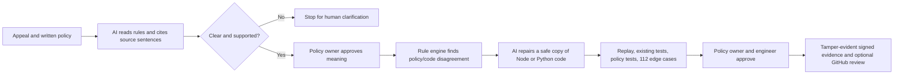

# Niyam

**Niyam catches when software wrongly rejects someone who qualifies under a written policy, repairs the decision code, and proves the fix before people approve it.**

[](https://github.com/Awowowow/niyam/actions/workflows/niyam-policy-ci.yml)

[Open the live application](https://d3rre9ztdq52vx.cloudfront.net) · [Browse the public source](https://github.com/Awowowow/niyam)

The worked example follows a scholarship applicant whose income and age satisfy the policy because of a disability exception—but the application rejects her because its code forgot that exception. Niyam connects the person, the policy, the faulty line, the repair, the tests, and the approvals in one visible chain.

Niyam is not a policy chatbot and the AI is not the eligibility judge. AI reads varied policy language and proposes a small code change. A repeatable rule engine determines the expected result, tests verify the repair, and people retain authority over policy meaning and code review.

## The five-step journey

1. **Tell the story** — Speak or type in Hindi or English. Niyam reconstructs the applicant facts and shows where the policy result and software result disagree.
2. **Check the policy** — Upload a PDF, paste text, or dictate a rule. AI links every extracted value to the exact source sentence. Unclear, exclusive, missing, or conflicting language stops for clarification.
3. **Repair the code** — After a policy owner approves the interpretation, AI works on a safe copy of a real Node or Python application and proposes the smallest responsible change.
4. **Verify the behavior** — Niyam reruns the rejected applicant, existing tests, new policy tests, and 112 generated edge cases across every demonstrated rule path.
5. **Approve and save evidence** — A policy owner and engineer approve before Niyam creates a tamper-evident signed record. Nothing merges automatically.

## What is real in the demo

- The public build uses live models through Amazon Bedrock: OpenAI `gpt-oss-120b` reads and cites policy rules; `Qwen3 Coder 480B` proposes source repairs.
- Judges can replace the sample policy with safe English or Hindi paraphrases and change the income cap, standard age limit, and disability relaxation.
- The repair changes real source code in an isolated Git branch, produces a real diff and commit, builds the target, and runs its tests.
- Both the Node/TypeScript and Python decision applications are executable targets, not screenshots or hard-coded UI outcomes.
- The original rejection is replayed before and after the repair.
- The independent verifier runs 112 exact-limit and interaction cases and reports the demonstrated rule-path coverage. It does not claim universal formal verification.
- The exported evidence includes policy and document fingerprints, source citations, the faulty line, patch, commit, test results, before/after replay, approvals, and a tamper-evident Ed25519 signature.
- A confirmed GitHub pull request can be opened for code review only after both required approvals. Niyam never merges or deploys the change automatically.

## Why AI is essential—and bounded

Real policies are not written in one template. The AI layer handles paraphrases, source linking, and source-code inspection that a fixed form cannot. Niyam then places hard boundaries around that work:

- Every extracted rule must cite text copied from the submitted policy.
- Missing, duplicate, conflicting, low-confidence, or unsupported rules stop for a person.
- Exclusive wording such as “under INR 400,000” is not silently changed into an inclusive rule.
- A policy owner approves the meaning before repair is available.
- AI proposes code; deterministic replay and tests decide whether the proposal behaves correctly.
- The original application remains unchanged until people choose to publish a reviewable branch.

## Try it

Use the [live application](https://d3rre9ztdq52vx.cloudfront.net) and follow the numbered guide:

1. Submit the prefilled Hindi appeal.
2. Read the sample policy with AI, or paste a safe paraphrase such as:

   > The scholarship accepts applicants whose annual household income is INR 425,000 or less. Applicants must be no older than 26 years. A documented disability extends the age limit by 5 years.

3. Confirm the cited interpretation as the policy owner.
4. Repair either the Node/TypeScript or Python application.
5. Inspect the faulty line, diff, before/after decision, test results, and 112 edge cases.
6. Add policy-owner and engineer approvals, then create and download the signed evidence.

The interface explains each action and safety gate, so the default journey can be completed without narration.

## Measured judge-build reliability

The deployed live-AI build was exercised on 17 July 2026 with fresh sessions:

- **12/12** end-to-end live-AI runs succeeded across the sample policy and two manually entered policies.
- Mean end-to-end time was **10.04 seconds** (2.56 seconds for policy reading and 6.27 seconds for code repair).
- **10/10** cold page loads resolved runtime, policy-history, and evidence status within three seconds.
- **5/5** clean, full five-step journeys completed after using **Start over**.
- Live repair retries once with the same approved policy and safety gates; if both attempts fail, the interface reports the failure and confirms that no code changed or merged.

The repeatable production test is in [`scripts/live-ai-reliability.mjs`](scripts/live-ai-reliability.mjs).

## Supported scope and honest limits

The current verified product domain is scholarship eligibility with:

- an inclusive annual household-income maximum;
- an inclusive standard age maximum; and
- a numeric disability age relaxation.

Niyam accepts multiple explicit English and Hindi phrasings for those rules. It intentionally stops on genuinely ambiguous or exclusive boundaries, missing units or values, conflicting thresholds, unsupported domains, and unreasonable numeric ranges. It does not claim perfect legal interpretation, universal repair of arbitrary software, real affected-person counts from fictional samples, or autonomous production deployment.

## Architecture



Technical terms used in the product:

- **Policy/code check** — an automatic test before merge that catches a future mismatch between an approved rule and application behavior. This is the function sometimes called Policy CI.
- **Executable rule contract** — the precise, versioned rule approved by a person and used to calculate the expected outcome.
- **Ed25519 signature** — a cryptographic signature that lets another person detect whether the exported evidence was altered after signing.
- **SHA-256 fingerprint** — a document identifier that changes if the source document changes.

## Repository map

```text
apps/web/                         Next.js guided investigation and repair UI
apps/api/                         NestJS policy, history, repair, and evidence API
apps/verification/                FastAPI PDF extraction and bounded solver
packages/policy-ir/               cited, human-approved executable rule schema
packages/rule-engine/             deterministic evaluation and decision traces
packages/boundary-generator/      exact-limit and interaction case generation
packages/verifier-core/           differential audit and rule fingerprinting
packages/application-adapters/    Node, Python, OpenAPI, and browser adapters
packages/repair-agent/            Bedrock policy-reading and source-repair clients
examples/                         real buggy/protected decision applications
contracts/                        rule used by the permanent pre-merge check
infra/aws/                        ECS Fargate, ALB, CloudFront, IAM, and deployment
```

More detail: [architecture](docs/ARCHITECTURE.md), [threat model](docs/THREAT_MODEL.md), and [AWS deployment](infra/aws/README.md).

## Run locally

Requirements: Node.js 22+, pnpm 11+, Python 3.11+, and Git.

```bash
corepack enable
corepack prepare pnpm@11.7.0 --activate
pnpm install
python3 -m venv apps/verification/.venv
apps/verification/.venv/bin/pip install -e "apps/verification[test]"
```

Start PDF extraction and bounded verification:

```bash
pnpm dev:solver
```

In a second terminal, start the web and API applications:

```bash
NIYAM_SOLVER_URL=http://127.0.0.1:8000 pnpm dev
```

Open [http://localhost:3000](http://localhost:3000). The API is at [http://localhost:4000/api](http://localhost:4000/api), and its interactive documentation is at [http://localhost:4000/docs](http://localhost:4000/docs).

Without the Python service, the core local demo remains available and labels its previously verified replay mode. PDF extraction and solver-specific evidence require the Python service.

## Verify the project

```bash
pnpm check
```

This typechecks every workspace, runs the unit, API, adapter, example-app, and bounded-solver tests, builds production artifacts, and executes the permanent policy/code guard.

For a deployed build:

```bash
NIYAM_PUBLIC_URL=https://d3rre9ztdq52vx.cloudfront.net \
NIYAM_RELIABILITY_RUNS=12 \
node scripts/live-ai-reliability.mjs
```

## Live AI configuration

No OpenAI API credits are required. The public backend authenticates to Amazon Bedrock with AWS credentials. Copy the documented variables from [`.env.example`](.env.example).

For unconfigured local development, keep:

```dotenv
NIYAM_ENABLE_AI_EXTRACTION=false
NIYAM_ENABLE_CODEX_REPAIRS=false
NIYAM_JUDGE_MODE=false
```

The public AWS template enables live extraction, live repair, and judge mode after the runtime role receives Bedrock model access. Judge mode refuses to silently replace unavailable AI with a simulated result. The local replay path is deliberately narrow, clearly labelled, and permitted only outside public judge mode.

Accounts with OpenAI frontier-model entitlement can switch `NIYAM_AI_BACKEND` to `codex` and configure [`.codex/bedrock.config.example.toml`](.codex/bedrock.config.example.toml) without changing the verification or approval layers.

## Submission resources

- [Three-minute demo runbook](docs/DEMO_RUNBOOK.md)
- [Judge questions and answers](docs/JUDGE_QA.md)
- [Submission copy](docs/SUBMISSION.md)
- [Demo policy PDF](output/pdf/niyam-demo-policy.pdf)

The video and spoken script should tell the human story first, then prove that the AI, code change, tests, and approvals are real.
