# Niyam Policy CI architecture

Niyam separates communication, policy authority, software execution, repair, and evidence so that no model-produced sentence becomes an eligibility decision by itself.

```mermaid
flowchart LR
  D[English or Hindi policy document] --> X[Cited extraction]
  X --> A{Ambiguous?}
  A -- yes --> S[Stop for policy owner]
  A -- no --> H[Explicit human approval]
  H --> C[Versioned executable contract]
  C --> G[Boundary interaction and temporal cases]
  G --> E[Node Python OpenAPI or browser adapter]
  E --> Q{Outcomes agree?}
  Q -- no --> P[Concrete affected person]
  P --> T[Runtime to source trace]
  T --> R[Isolated repository repair]
  R --> V[Existing tests plus adversarial verification]
  V --> B[Ed25519 signed evidence bundle]
  B --> U[Policy owner and engineer approval]
  U --> PR[GitHub pull request]
  PR --> CI[Permanent Policy CI status check]
```

The deterministic TypeScript engine owns expected outcomes. The bounded Z3 service searches a declared scholarship subset and never claims universal proof. In the default judge build, OpenAI gpt-oss-120b performs cited policy extraction and Qwen3 Coder 480B proposes a bounded single-file repair through Amazon Bedrock. Niyam—not either model—generates the contract tests and independently verifies the executable. Accounts with frontier-model entitlement can select the Codex-on-Bedrock worker instead. The offline worker repairs only the supported decision-function subset and labels itself accordingly.

The seeded in-memory workspace is the offline hackathon fallback. Production should replace it with durable object storage for documents/evidence and a transactional database for versions, approvals, decisions, and rollback records.
